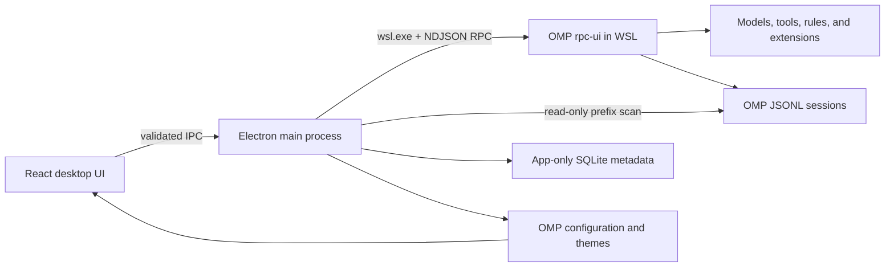

<p align="center">
  
</p>

<h1 align="center">OMP Desktop</h1>

<p align="center">
  An unofficial Windows desktop workspace for running
  <a href="https://github.com/can1357/oh-my-pi">Oh My Pi (OMP)</a>
  inside WSL2.
</p>

<p align="center">
  Start OMP faster, continue existing sessions, switch models, and manage your local workspace without replacing OMP's agent, tools, rules, extensions, or permission model.
</p>

<p align="center">
  <a href="https://github.com/Eijnewgnaw/omp-desktop/actions/workflows/ci.yml"></a>
  <a href="https://github.com/Eijnewgnaw/omp-desktop/releases"></a>
  <a href="LICENSE"></a>
  
  
</p>

<p align="center">
  English · <a href="README.zh-CN.md">简体中文</a>
</p>


> [!IMPORTANT]
> OMP Desktop is an early Alpha. It has been integration-tested with OMP `17.2.12`; compatibility with other versions is best-effort while OMP's RPC and session formats continue to evolve.

## Why OMP Desktop?

OMP is a powerful terminal-first agent. OMP Desktop adds a focused graphical workspace around the existing runtime:

- Discover OMP installations across local WSL distributions.
- Start a task after choosing a WSL workspace.
- Find, open, and continue existing OMP JSONL sessions.
- Search, pin, archive, restore, or move sessions to a recoverable app trash.
- Read paginated history and continue the same session through OMP RPC.
- Select from the models reported by OMP and switch with OMP's native `set_model` RPC command.
- Display streaming replies, reasoning, Markdown, code, and tool execution.
- Handle OMP extension requests such as confirmation, selection, text input, and editor input.
- Follow OMP's light, dark, custom, symbol, and color-blind theme settings.
- Reopen any workspace or session in Windows Terminal.

OMP remains the only agent runtime and source of truth. The desktop app does not implement a second agent or copy OMP's decision logic.

## Project status

| Component | Status |
| --- | --- |
| Windows 11 x64 | Primary release target |
| WSL2 | Required by the packaged Windows app |
| OMP `17.2.12` | Tested |
| Other OMP versions | Best-effort Alpha compatibility |
| Linux under WSLg | Development compatibility mode |
| macOS / native Linux desktop | Not currently supported |
| Installer signing | Not yet available |
| Automatic updates | Not yet available |
| Application language | Primarily Simplified Chinese in the current Alpha |

The installer is not code-signed yet, so Windows SmartScreen may show an **Unknown publisher** warning. Download builds only from this repository's Releases page.

## Requirements

- Windows 11 x64
- WSL2 with at least one installed Linux distribution
- A working OMP installation inside that distribution
- OMP already configured with the models, credentials, tools, extensions, and rules you want to use
- Windows Terminal for the terminal handoff feature

Verify OMP inside WSL before installing the desktop app:

```bash
command -v omp
omp --version
```

OMP Desktop does not install or configure OMP for you.

## Installation

1. Open the [Releases page](https://github.com/Eijnewgnaw/omp-desktop/releases).
2. Download the newest `OMP-Desktop-*.exe` installer.
3. Run the installer.
4. Launch OMP Desktop and select the detected WSL installation.
5. Choose a workspace, start a new task, or select an existing session in the sidebar.

The session menu provides **Continue**, **Open in original terminal**, **Pin**, **Archive/Restore**, and **Move to Trash**. Before handing an owned session to Windows Terminal or moving it to Trash, the app verifies that its desktop RPC runtime has stopped. A successful terminal handoff returns the desktop composer to a fresh session so it cannot accidentally resume the same JSONL in parallel. Move to Trash is confirmed first and relocates the JSONL session plus its adjacent artifact directory under:

```text
<OMP agent directory>/trash/omp-desktop/
```

It does not permanently delete the files.

## How it works



The Windows build starts one supervised OMP `rpc-ui` process in WSL. Existing sessions are passed back to OMP through `--resume`; the app then requests OMP state, paginated history, and available models. Subsequent prompts and model changes go to that same runtime.

Runtime replacement is serialized so only one session owns the desktop RPC connection. Shutdown first requests a graceful OMP abort and stdin close; if needed, the app terminates only the exact supervised WSL process group instead of stopping the entire distribution.

## Data, privacy, and security

OMP Desktop is local-first:

- Model requests, tool calls, session writes, configuration, and extensions are handled by your local OMP installation.
- The app reads only the beginning of each OMP JSONL file to build its session index.
- It does not rewrite session content. OMP itself persists resumed conversations.
- Pin, archive state, and app preferences live in a separate local SQLite database.
- A session is moved only after you explicitly confirm **Move to Trash**.
- The app collects no telemetry, uploads no conversations, and stores no model-provider API keys.

The renderer uses context isolation, Electron sandboxing, web security, and no Node.js integration. File, process, and WSL operations are exposed through a small typed preload API with input and path validation. External navigation is denied by default; HTTP(S) links are handed to the system browser.

This desktop shell is not a security boundary for OMP, its extensions, model providers, or code executed in your workspace. Review OMP's displayed intent and confirmation requests before allowing sensitive actions. See [SECURITY.md](SECURITY.md) for vulnerability reporting.

## Theme integration

OMP Desktop derives its interface from OMP's semantic theme configuration rather than maintaining an unrelated palette. It reads:

- `theme.dark`
- `theme.light`
- `symbolPreset`
- `colorBlindMode`
- Custom themes from the OMP agent directory

The interface follows the selected OMP light or dark theme and reacts to system appearance changes when configured to do so. Bundled theme attribution is recorded in [THIRD_PARTY_NOTICES.md](THIRD_PARTY_NOTICES.md).

## Development

Prerequisites: Node.js `22.20` or newer, npm, and a working OMP installation. Windows with WSL2 is required for complete packaged-app integration; WSLg can run the Linux development shell.

```bash
git clone git@github.com:Eijnewgnaw/omp-desktop.git
cd omp-desktop
npm ci
npm run dev
```

Create a production build or Windows installer:

```bash
npm run build
npm run dist -- --win --x64 --publish never
```

## Testing

```bash
npm run typecheck
npm test
npm run test:integration
npm run test:e2e:resume
```

| Command | Purpose |
| --- | --- |
| `npm run typecheck` | Type-check main, preload, shared, and renderer code |
| `npm test` | Run unit, boundary, lifecycle, trash, and terminal-launch tests |
| `npm run test:integration` | Use real OMP to negotiate RPC, read state, and list models without sending a prompt |
| `npm run test:e2e` | Run the visual Electron smoke test |
| `npm run test:e2e:resume` | Use a fake OMP runtime to verify resume/send, model switching, continuation frames, error recovery, reconnects, terminal handoff, and new-session ownership without a model call |
| `npm run build` | Produce production Electron bundles |

## Repository structure

```text
src/
  main/       WSL discovery, OMP lifecycle, session indexing, themes, and IPC
  preload/    Minimal typed bridge exposed to the renderer
  renderer/   React conversation and session-management interface
  shared/     Cross-process contracts and generated OMP theme data
tests/        Unit, integration, security, and Electron end-to-end tests
docs/         Architecture notes and screenshots
scripts/      Theme synchronization utilities
build/        Application icons
```

## Roadmap

- Publish an OMP version compatibility matrix.
- Improve extension widget and status rendering.
- Add editable session labels, tags, and an in-app trash browser.
- Add batch session operations and cross-project filtering.
- Add full English UI localization.
- Provide signed installers and a safe update flow when release infrastructure is available.

## Contributing

Issues and pull requests are welcome. Read [CONTRIBUTING.md](CONTRIBUTING.md) before making a change. When reporting a bug, include the Windows version, WSL distribution, OMP version, OMP Desktop version, reproduction steps, and redacted diagnostics. Never include API keys, access tokens, or unredacted session files.

## Acknowledgements and disclaimer

OMP Desktop is built around [Oh My Pi](https://github.com/can1357/oh-my-pi). It is an independent community project and is not officially affiliated with or endorsed by the Oh My Pi authors. The Oh My Pi name, source code, and theme assets remain the property of their respective rights holders.

OMP Desktop is released under the [MIT License](LICENSE).
