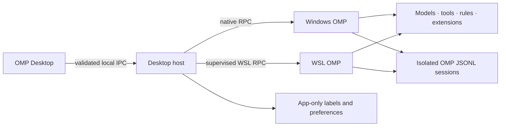

<p align="center">
  
</p>

<h1 align="center">OMP Desktop</h1>

<p align="center">
  <strong>Bring terminal-first OMP into a focused desktop workspace.</strong><br />
  Start faster, return to any session, switch models, and keep every project organized—while Oh My Pi remains the agent runtime.
</p>

<p align="center">
  <a href="https://github.com/Eijnewgnaw/omp-desktop/releases/latest"><strong>Download for Windows</strong></a>
  · <a href="#what-you-can-do">Explore features</a>
  · <a href="README.zh-CN.md">简体中文</a>
</p>

<p align="center">
  <a href="https://github.com/Eijnewgnaw/omp-desktop/actions/workflows/ci.yml"></a>
  <a href="https://github.com/Eijnewgnaw/omp-desktop/releases"></a>
  <a href="LICENSE"></a>
  
  
</p>


<p align="center"><sub>English product preview. The v0.1.0 application interface is currently Simplified Chinese.</sub></p>

## OMP power, desktop flow

OMP Desktop is an independent, local-first desktop companion for [Oh My Pi (OMP)](https://github.com/can1357/oh-my-pi). It removes the friction around launching projects and finding sessions without replacing the part that matters: OMP still owns the agent, models, tools, rules, extensions, permissions, and conversation files.

The result is a calmer way to work across many codebases while keeping the original terminal experience one click away.

## What you can do

| | Feature | What it gives you |
| --- | --- | --- |
| **01** | **One runtime, profile, and workspace per session** | Click New session, choose Windows or WSL, then select that location's OMP Profile and project folder. Return to the exact combination later. |
| **02** | **Continue real OMP sessions** | Browse local OMP JSONL history, reopen an earlier task, and keep talking through OMP's native RPC runtime. |
| **03** | **Model selection** | Choose from the models reported by OMP and switch through OMP's own `set_model` command. |
| **04** | **A session library** | Search, rename, pin, archive, restore, move to Trash, or permanently delete sessions from one sidebar. |
| **05** | **Rich agent activity** | Follow streaming replies, reasoning, Markdown, code, tool execution, and extension confirmation requests. |
| **06** | **Theme continuity** | Match OMP's light, dark, custom, symbol, and color-blind theme settings instead of maintaining a disconnected palette. |

## Built around session continuity

Start a new task without carrying over the previous folder. **New session opens one setup dialog**: its top level contains only **Windows** and **WSL**, followed by the Profiles available in that location and a project-folder picker. Profiles stay visually subordinate to those two locations while remaining safely isolated underneath, with their own agent directory, sessions, theme, metadata, and recent workspace. Reopen a saved task with that exact environment and working directory; changing the default for future tasks never retargets saved sessions. Native `C:\...` paths and WSL `/...` paths stay isolated—OMP Desktop never silently translates or merges them.

Need the terminal? Hand the session to a visible Windows Terminal window. OMP Desktop releases its RPC runtime first and records a handoff lock, so the desktop cannot silently open a second writer for the same JSONL. Close terminal OMP and explicitly reclaim the session when you want it back in the app.

## Session controls you can understand

**Move to Trash** and **Delete permanently** are deliberately different actions:

- **Move to Trash** relocates the indexed JSONL and its adjacent artifact folder to `<OMP data directory>/trash/omp-desktop/`, where they can be recovered manually. Without an XDG data override, the data directory is normally the OMP agent directory.
- **Delete permanently** opens a dedicated warning dialog, identifies the exact session, and deletes it only after you click the destructive confirmation button. It cannot be undone.

Before handoff, Trash, or permanent deletion, the app verifies that the desktop-owned OMP runtime has actually stopped. Paths, installation identity, session indexing, file type, and containment inside the OMP sessions directory are checked again in the main process.

## OMP stays the source of truth



- OMP handles every model request, tool call, permission decision, extension, and session write.
- OMP Desktop does not install OMP, store provider API keys, upload conversations, collect telemetry, or rewrite session content.
- Desktop-only names, pins, archive state, and preferences live in a separate local SQLite database, isolated by OMP installation, Profile, and runtime environment.

## Get started

### Requirements

- Windows 11 x64
- A working, already configured OMP installation on native Windows, inside WSL2, or both
- Windows Terminal for terminal handoff

Verify native Windows OMP in PowerShell:

```powershell
& "$env:LOCALAPPDATA\omp\omp.exe" --version
```

Or verify OMP inside WSL:

```bash
command -v omp
omp --version
```

Then:

1. Download the newest installer from [GitHub Releases](https://github.com/Eijnewgnaw/omp-desktop/releases/latest).
2. Install and launch OMP Desktop.
3. Click **New session** and choose **Windows** or **WSL** in the setup dialog.
4. Select a **Profile** and project folder, create the session, and send your first message—or select an existing session to continue it in its original environment.

> [!NOTE]
> The installer is not code-signed yet, so Windows SmartScreen may show **Unknown publisher**. Download builds only from this repository's Releases page.

## Current compatibility

| Environment | Status |
| --- | --- |
| Windows 11 x64 + native Windows OMP | Supported v0.1.0 target; tested with OMP 17.2.15 |
| Windows 11 x64 + OMP in WSL2 | Supported v0.1.0 target; tested with OMP 17.2.12 |
| Default and named OMP Profiles | Supported as isolated choices beneath Windows or WSL |
| Other OMP versions | Best-effort compatibility |
| Application interface | Simplified Chinese in v0.1.0 |
| WSLg Linux shell | Development use |
| macOS / native Linux desktop | Not currently supported |

## Where next

- Wider OMP compatibility matrix
- More extension widget and status rendering
- Session tags, batch operations, filters, and an in-app Trash browser
- Complete UI localization, signed installers, and safe updates

## Learn more

- [Development guide](docs/DEVELOPMENT.md) — setup, testing, packaging, and project conventions
- [Architecture](docs/ARCHITECTURE.md) — runtime, session, RPC, theme, and security boundaries
- [Security policy](SECURITY.md) — supported versions and private vulnerability reporting
- [Contributing](CONTRIBUTING.md) — change principles and contribution checklist
- [Changelog](CHANGELOG.md) — release history
- [Third-party notices](THIRD_PARTY_NOTICES.md) — licenses for bundled OMP theme data

OMP Desktop is an independent community project and is not affiliated with or endorsed by the Oh My Pi authors. Oh My Pi's name, source code, and theme assets remain the property of their respective rights holders. OMP Desktop is released under the [MIT License](LICENSE).
