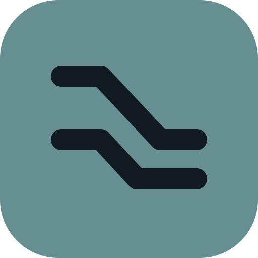
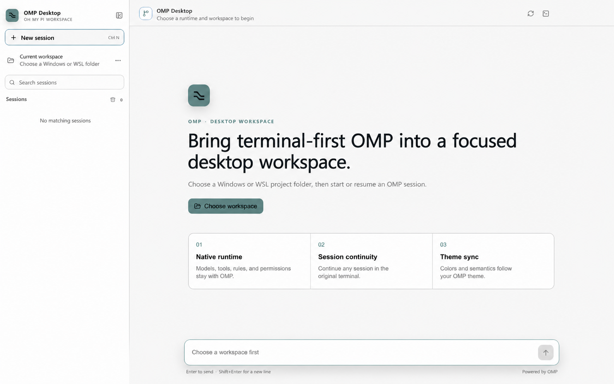

  

<h1 align="center">OMP Desktop</h1>

  <strong>把终端优先的 OMP，放进一个专注、好管理的桌面工作台。</strong> 
  更快启动项目、继续任意会话、切换模型并管理本地任务，同时让 Oh My Pi 始终作为真正的 agent 运行时。

  <a href="https://github.com/Eijnewgnaw/omp-desktop/releases/latest"><strong>下载 Windows 版本</strong></a>
  · <a href="#你可以做什么">查看功能</a>
  · <a href="README.md">English</a>

  
  
  
  

英文产品预览图；v0.1.0 的实际应用界面目前为简体中文。

## OMP 的能力，桌面端的工作流

OMP Desktop 是 [Oh My Pi（OMP）](https://github.com/can1357/oh-my-pi) 的独立、本地优先桌面伴侣。它减少启动项目、寻找会话和切换上下文的摩擦，但不替代 OMP：agent、模型、工具、规则、扩展、权限和会话文件仍全部由 OMP 负责。

## 你可以做什么

| | 功能 | 带来的体验 |
| --- | --- | --- |
| **01** | **每个会话独立运行环境、Profile 与工作区** | 点击新建会话，只需先选 Windows 或 WSL，再选择该位置的 Profile 与项目目录；恢复时回到原来的完整组合。 |
| **02** | **继续真实 OMP 会话** | 浏览本地 OMP JSONL 历史，重新打开旧任务，并通过 OMP 原生 RPC 继续交流。 |
| **03** | **模型选择** | 读取 OMP 返回的可用模型，并通过 OMP 自身的 `set_model` 命令切换。 |
| **04** | **会话资料库** | 在侧边栏搜索、重命名、置顶、归档、恢复、移到回收站或彻底删除会话。 |
| **05** | **完整 Agent 动态** | 查看流式回复、思考内容、Markdown、代码、工具执行与扩展确认请求。 |
| **06** | **OMP 主题同步** | 跟随 OMP 的亮色、暗色、自定义、符号及色盲主题语义，不维护割裂的平行配色。 |

## 围绕会话连续性设计

新会话不会继承上一个项目目录。点击 **新建会话** 会打开统一弹窗：第一层只显示 **Windows** 与 **WSL**，随后再选择该位置下的 **Default** 或命名 **Profile**，最后选择项目目录。Profile 在界面上从属于 Windows/WSL 两个位置，底层仍保持完整隔离，分别拥有自己的 agent 目录、会话、主题、桌面元数据和最近工作区；保存后会话始终绑定原环境与 JSONL 中自己的 `cwd`，修改未来新会话的默认环境不会改写旧会话。`C:\...` 和 `/...` 不会被自动转换或合并。

需要回到终端时，可把会话交给一个可见的 Windows Terminal 窗口。桌面端会先释放 RPC 运行时并保存交接锁，避免两个进程同时写同一份 JSONL。关闭终端 OMP 后，再明确确认由桌面端重新接管。

## 明确区分两种删除

- **移到回收站**：把已索引 JSONL 与相邻附件目录移动到 `<OMP data 目录>/trash/omp-desktop/`，可手动恢复；未启用 XDG 数据目录时，它通常就是 OMP agent 目录。
- **彻底删除**：弹出独立警告窗口，显示准确会话，只有点击危险确认按钮后才会删除，不可恢复。

终端交接、回收或永久删除前，App 都会验证桌面端拥有的 OMP 进程已经停止；主进程还会再次校验 OMP 安装身份、会话索引、路径边界、文件类型和 sessions 根目录约束。

## OMP 始终是唯一事实来源

- 模型请求、工具调用、权限、扩展和会话写入均由本机 OMP 完成。
- OMP Desktop 不安装 OMP、不保存模型 API 密钥、不上传会话、不收集遥测，也不改写 JSONL。
- 会话别名、置顶、归档和偏好保存在独立 SQLite 数据库中，并按 OMP 安装、Profile 及运行环境隔离。

## 开始使用

需要 Windows 11 x64、Windows 原生或 WSL2 中已经配置好的 OMP，以及用于终端交接的 Windows Terminal。两种 OMP 可以同时安装。

1. 在 PowerShell 中运行 `& "$env:LOCALAPPDATA\omp\omp.exe" --version`，或在 WSL 中确认 `command -v omp` 和 `omp --version` 可用。
2. 从 [GitHub Releases](https://github.com/Eijnewgnaw/omp-desktop/releases/latest) 下载最新安装包。
3. 安装并启动 OMP Desktop，点击“新建会话”，在弹窗中选择 Windows 或 WSL、对应 Profile 和项目目录。
4. 点击“新建会话”，在该运行环境中选择工作区，或在旧会话原有环境中继续。

> [!NOTE]
> 安装包暂未代码签名，Windows SmartScreen 可能显示“未知发布者”。请只从本仓库 Release 页面下载。

## 当前兼容性

| 环境 | 状态 |
| --- | --- |
| Windows 11 x64 + Windows 原生 OMP | v0.1.0 正式支持目标；已测试 OMP 17.2.15 |
| Windows 11 x64 + WSL2 OMP | v0.1.0 正式支持目标；已测试 OMP 17.2.12 |
| Default 与命名 OMP Profiles | 作为 Windows/WSL 下彼此隔离的二级选项正式支持 |
| 其他 OMP 版本 | 尽力兼容 |
| 应用界面 | v0.1.0 为简体中文 |
| WSLg Linux 壳 | 开发用途 |
| macOS / 原生 Linux 桌面 | 暂不支持 |

## 后续方向

- 更完整的 OMP 版本兼容矩阵
- 更丰富的扩展 widget/status 展示
- 会话标签、批量操作、筛选和 App 内回收站
- 完整 UI 本地化、签名安装包与安全更新

## 项目文档

- [开发指南](docs/DEVELOPMENT.md)
- [第三方版权声明](THIRD_PARTY_NOTICES.md)
- [架构说明](docs/ARCHITECTURE.md)
- [安全策略](SECURITY.md)
- [参与贡献](CONTRIBUTING.md)
- [版本记录](CHANGELOG.md)

OMP Desktop 是独立社区项目，与 Oh My Pi 作者不存在官方隶属或背书关系。Oh My Pi 的名称、源码和主题资产归其各自权利人所有。OMP Desktop 使用 [MIT License](LICENSE)。
