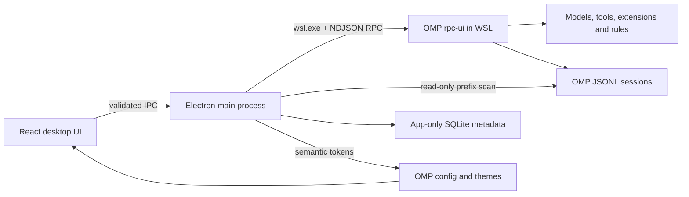

# Architecture

OMP Desktop 是 OMP 的桌面宿主，不是新的 agent 运行时。



## Process boundary

在 Windows 发布版中，主进程枚举 WSL 发行版并探测 `omp`。启动会话时使用参数数组执行：

```text
wsl.exe -d <distro> --cd <cwd> --exec <omp> --mode rpc-ui --cwd <cwd> [--resume <session>]
```

OMP 仍负责模型选择、系统提示、扩展、工具、权限和会话持久化。桌面壳只消费 RPC 帧并发送用户明确触发的协议命令。

## RPC handling

- 等待 `ready` 帧后协商协议 v2。
- v1 使用单行 JSON；v2 同时支持长度前缀分块帧。
- 会话历史通过 `get_messages_page` 按稳定游标读取。
- 遇到 `session_busy` 或 `stale_cursor` 时丢弃分页快照并退回旧版完整读取。
- 未识别的帧会被安全忽略，避免 OMP 添加事件后让 App 崩溃。

## Session model

会话索引只读取每个 JSONL 文件开头的固定标题槽和 session header。App 不写入 OMP 会话文件；置顶、归档、显示标题和标签属于独立 SQLite 元数据，可在不影响 OMP 的情况下删除或重建。

## Theme model

内置主题由 OMP `v17.2.12` 源码生成，并解析变量引用、ANSI 256 色和导出背景色。运行时会读取：

- `theme.dark`
- `theme.light`
- `symbolPreset`
- `colorBlindMode`
- OMP agent 目录下的自定义主题

主题轮询和系统明暗模式变化会更新 CSS 语义变量。主题同步失败时使用与模式匹配的内置回退主题。

## Security boundary

Renderer 运行在 Electron sandbox 中，没有 Node.js 权限。所有文件、进程和 WSL 操作都经过固定 preload API，主进程再使用 schema、发行版名和 POSIX 路径规则验证。外部 URL 只允许交给系统浏览器打开 HTTP(S) 地址。
