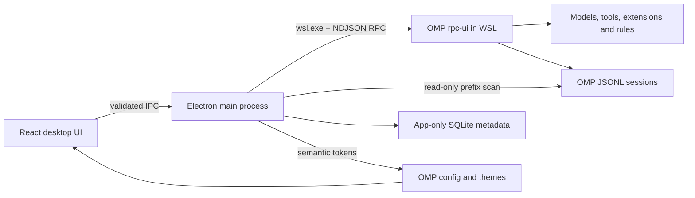

# Architecture

OMP Desktop 是 OMP 的桌面宿主，不是新的 agent 运行时。



## Process boundary

在 Windows 发布版中，主进程枚举 WSL 发行版并探测 `omp`。启动会话时通过固定 supervisor 脚本和独立参数执行 OMP，用户路径不会插入 shell 脚本文本。supervisor 使用独立进程组并记录精确 PGID，便于 App 退出或切换会话时只清理对应的 OMP：

```text
wsl.exe -d <distro> --cd <cwd> --exec /bin/sh -c <fixed-supervisor> ... <omp> --mode rpc-ui --cwd <cwd> [--resume <session>]
```

OMP 仍负责模型目录、模型切换、系统提示、扩展、工具、权限和会话持久化。桌面壳只消费 RPC 帧并发送用户明确触发的协议命令。RuntimeManager 将启动和停止串行化，任一窗口只保留一个受管 RPC 运行时。

## RPC handling

- 等待 `ready` 帧后协商协议 v2。
- v1 使用单行 JSON；v2 同时支持长度前缀分块帧。
- 会话历史通过 `get_messages_page` 按稳定游标读取。
- 模型选择通过 `get_available_models` 和 `set_model` 完成，不直接读写 OMP 模型配置。
- 仅把 `isTerminal !== false` 的 `agent_end` 视为一次运行的最终结束；本地命令通过响应中的 `agentInvoked: false` 或 `prompt_result` 结束。
- 普通命令失败作为 RPC 错误显示给用户，不会被误判为整个 OMP 进程崩溃。
- 遇到 `session_busy` 或 `stale_cursor` 时丢弃分页快照并退回旧版完整读取。
- 未识别的帧会被安全忽略，避免 OMP 添加事件后让 App 崩溃。

## Session model

Renderer 只维护一个会话目标：未启动的新会话，或已保存的 OMP 会话。新会话不会继承上一个目录；用户先创建新会话，再为它选择工作区。已保存会话的工作区来自自己的 JSONL session header，在桌面端不可被全局目录覆盖。OMP 第一次发布 session path 后，该路径会绑定到当前新会话，并在索引刷新时提升为已保存会话。

会话索引只读取每个 JSONL 文件开头的固定标题槽和 session header。App 不重写 OMP 会话内容；置顶、归档、显示标题和标签属于独立 SQLite 元数据，可在不影响 OMP 的情况下删除或重建。App 持续跟踪 OMP 实际发布的 session path；终端交接、回收和永久删除必须先严格验证拥有该文件的受管进程已经退出。

- “移到回收站”只会把已索引 JSONL 及同名附件目录移动到 agent 目录内的 `trash/omp-desktop`。
- “彻底删除”经过独立的文字确认，并先把精确目标原子移动到 agent 目录内的私有 staging 目录，再删除 staging；路径、索引、文件类型和附件目录都会重新验证。
- 两种操作都拒绝越出 sessions 根目录的路径，不会使用通配符或递归删除会话根目录。

把会话交给原始终端后，App 会持久保存 handoff lease。该 JSONL 在用户明确确认终端中的 OMP 已关闭前不能被桌面 RPC 再次恢复，避免两个 writer 同时写入。

## Runtime backends

当前 Alpha 的发布后端是 WSL2。后续 Windows 原生 OMP 支持会作为独立 adapter 加入：Windows adapter 直接调用 `omp.exe` 并使用 Win32 路径，WSL adapter 继续通过指定发行版调用 POSIX 路径。保存的会话必须绑定其原 adapter、安装目标和工作区，不会在 `C:\...` 与 `/mnt/c/...` 之间隐式迁移。

## Theme model

内置主题由 OMP `v17.2.12` 源码生成，并解析变量引用、ANSI 256 色和导出背景色。运行时会读取：

- `theme.dark`
- `theme.light`
- `symbolPreset`
- `colorBlindMode`
- OMP agent 目录下的自定义主题

主题轮询和系统明暗模式变化会更新 CSS 语义变量。主题同步失败时使用与模式匹配的内置回退主题。

## Security boundary

Renderer 运行在 Electron sandbox 中，没有 Node.js 权限。所有文件、进程和 WSL 操作都经过固定 preload API，主进程再使用 schema、发行版名和 POSIX 路径规则验证。外部 URL 只允许交给系统浏览器打开 HTTP(S) 地址。
